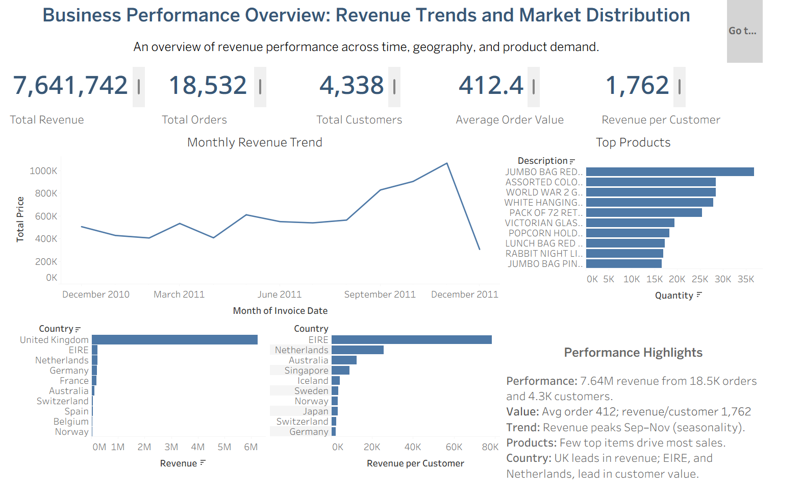

\# Customer Segmentation \& RFM Analysis (Online Retail)

\## Project Overview

Customer behavior in retail is often uneven, with a small proportion of customers contributing a disproportionate share of total revenue. Understanding these behavioral differences is critical for optimizing retention, improving marketing efficiency, and maximizing customer lifetime value.

This project applies \*\*data cleaning, exploratory data analysis (EDA), and RFM (Recency, Frequency, Monetary) modeling\*\* to segment customers based on purchasing behavior. The analysis identifies high-value customers, at-risk segments, and growth opportunities, enabling data-driven customer strategy.

\## Business Problem

Retail businesses frequently lack visibility into:

\* Which customers generate the most value

\* Which customers are at risk of churn

\* How purchasing behavior varies across time and markets

Without structured segmentation, marketing efforts remain inefficient and reactive.

This project addresses these gaps by using \*\*RFM-based customer segmentation\*\* to support targeted engagement, retention strategies, and revenue optimization.

\## 🛠 Methodology

The project follows a structured analytical workflow:

\### 1. Data Validation \& Cleaning

\* Removed missing CustomerID records (\~25% of dataset)

\* Eliminated invalid transactions (negative/zero Quantity and UnitPrice)

\* Removed duplicate rows while preserving valid multi-line invoices

\* Converted data types (InvoiceDate → datetime, identifiers → string)

\* Applied \*\*99th percentile capping\*\* to control outliers

\* Created revenue variable: \*\*TotalPrice = Quantity × UnitPrice\*\*

\### 2. Exploratory Data Analysis (EDA)

\* Distribution analysis of Quantity, UnitPrice, and TotalPrice

\* Customer-level analysis (transactions, revenue, average order value)

\* Pareto analysis to assess revenue concentration

\* Monthly trend analysis to identify seasonality

\* Geographic analysis (revenue and transactions by country)

\### 3. RFM Feature Engineering

\* \*\*Recency\*\* – Days since last purchase

\* \*\*Frequency\*\* – Number of transactions

\* \*\*Monetary\*\* – Total customer spend

\* Applied log transformation to Frequency and Monetary to reduce skewness

\* Analyzed distributions and correlations across RFM variables

\### 4. Customer Segmentation

\* Assigned quartile-based RFM scores (1–4)

\* Combined scores into composite RFM segments

\* Classified customers into behavioral groups:

&#x20; \* Champions

&#x20; \* Loyal Customers

&#x20; \* Potential Loyalists

&#x20; \* New Customers

&#x20; \* At Risk

&#x20; \* Lost

\### 5. Data Visualization (Tableau)

\* Business performance dashboard (revenue, orders, customers)

\* Customer segmentation dashboard (distribution, value, behavior)

\## Key Results

\* Total revenue: \*\*7.64M\*\* from \*\*18.5K orders\*\* and \*\*4.3K customers\*\*

\* Revenue is highly concentrated: \~20% of customers contribute \~71% of total revenue

\* Customer activity is heavily skewed, with most customers purchasing infrequently

\* Strong seasonality observed, with revenue peaking between \*\*September–November\*\*

\* Frequency and Monetary show a positive relationship, indicating repeat buyers drive revenue

\* UK dominates total revenue, while some international markets show higher revenue per customer

\* High-value segments (Champions \& Loyal Customers) generate the majority of revenue

\## Business Insights

\* A small group of customers drives overall revenue performance

\* A large proportion of customers exhibit low engagement and low spending

\* Customer value is driven more by sustained behavior (frequency \& spend) than recency alone

\* Significant churn risk exists within the \*\*At Risk\*\* segment

\* Customer value evolves over time, creating opportunities to upgrade mid-tier segments

## Dashboard Preview

### Business Performance Dashboard

  

### Customer Segmentation Dashboard

  

\## Recommendations

\* Retain \*\*Champions\*\* through loyalty programs and personalized engagement

\* Upsell and cross-sell \*\*Loyal Customers\*\* to increase revenue contribution

\* Nurture \*\*Potential Loyalists\*\* into high-value segments

\* Strengthen onboarding for \*\*New Customers\*\* to drive repeat purchases

\* Re-engage \*\*At Risk customers\*\* through targeted campaigns and incentives

\* Apply selective win-back strategies for \*\*Lost Customers\*\*

\## Next Steps

\* Develop a \*\*customer churn prediction model\*\* using RFM features

\* Build a \*\*customer lifetime value (CLV) model\*\*

\* Implement \*\*behavioral targeting strategies\*\* for each segment

\* Conduct A/B testing on retention and engagement campaigns

\* Enhance dashboard with real-time monitoring of customer segments

\## Tools \& Technologies

\* Python

\* Pandas

\* NumPy

\* Matplotlib

\* Seaborn

\* Tableau

\* Jupyter Notebook

\## Project Structure

├── data/                # Processed datasets for analysis  

├── notebooks/           # Python analysis (EDA + RFM)  

├── tableau/             # Dashboard outputs  

├── images/              # Dashboard screenshots  

├── README.md  

├── requirements.txt  

└── .gitignore  

\## Environment \& Reproducibility

The analysis was conducted in a controlled Python environment to ensure reproducibility:

\* Python 3.x

\* Jupyter Notebook

\* Structured data pipeline (clean → analyze → segment → visualize)

All dependencies are documented in \*\*requirements.txt\*\*.

